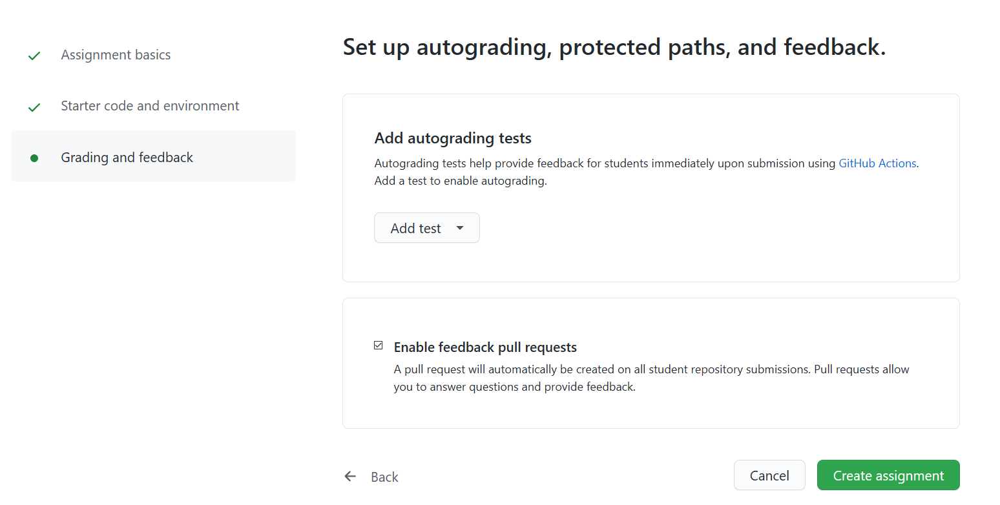
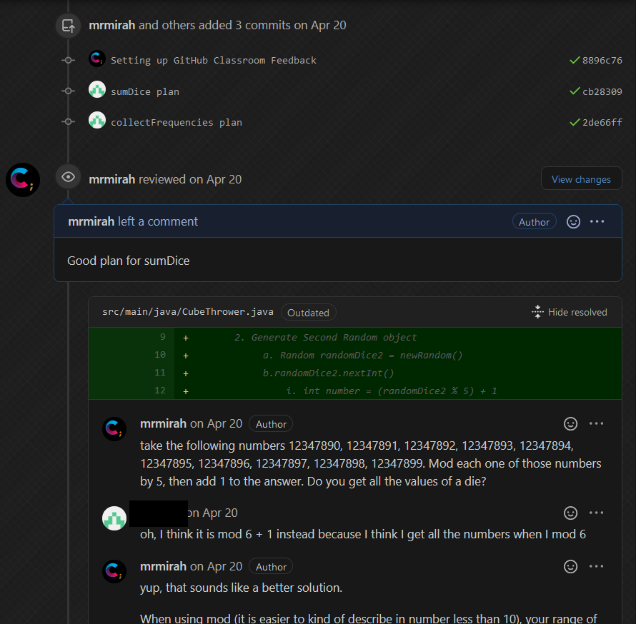

# Feedback Ideas
> Providing feedback to students can be helpful for them to see their errors and learn from them.  There are multiple ways to provide this feedback to students.  This repo will outline some of the ways to provide feedback to student repos.

If using GitHub Classroom to distribute assignment there is a fairly new feature (as of Spring 2020) that allows us to provide feedback in a pull request setting.  
To enable this we need to make sure the select the option when creating the assignment on GitHub Classroom

This allows that any student who accepts the assignment has an automatic pull request open.  It will be located immediately underneath the "Pull Request" tab on the repo.

Have this allows us to have conversations with students about their commits and provide them feedback.  You may highlight exact line(s) of code for the students to see what you are referencing and even offer suggestions on what to fix that student can accept with a simple button click to update their code.

Conversation can occur right through GitHub or even email as replaying to an email will update the conversation.

This pull request tab is also where students can see if they are passing or failing autograded tests that are setup through GitHub classroom.  The folder on how to setup some autograded tests will have more details on this concept.